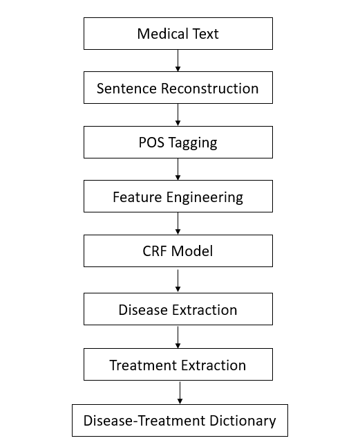
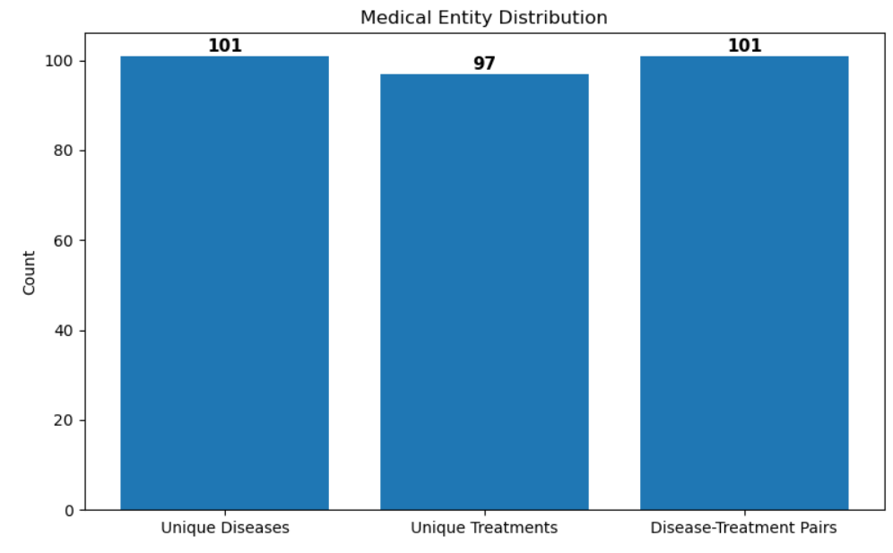
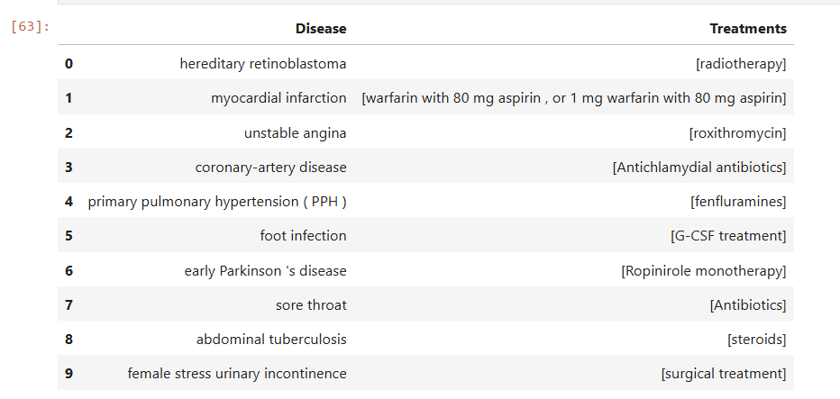
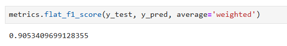

# Medical Named Entity Recognition and Treatment Extraction using Conditional Random Fields


---

## Project Overview

Healthcare organizations generate large volumes of unstructured clinical text containing valuable information about diseases, symptoms, medications, and treatment procedures. Extracting this information manually is time-consuming and difficult to scale.

This project develops a Natural Language Processing (NLP) pipeline capable of automatically identifying disease entities and their associated treatments from medical text using **Conditional Random Fields (CRF)**.

The extracted disease-treatment relationships can support clinical decision support systems, medical knowledge discovery, healthcare search engines, and information retrieval applications.

---

## Business Problem

Medical literature and clinical documents contain valuable disease-treatment information embedded within unstructured text.

The objective of this project is to automatically identify:

- Disease entities mentioned in medical text.
- Treatment entities associated with diseases.
- Disease-treatment relationships that can be used to construct a structured medical knowledge base.

The final output transforms unstructured clinical text into structured healthcare information.

---

## Project Objectives

1. Convert token-level datasets into sentence format.
2. Perform linguistic analysis using Part-of-Speech tagging.
3. Engineer contextual and lexical features for sequence labeling.
4. Train a Conditional Random Fields (CRF) model for Named Entity Recognition.
5. Evaluate entity extraction performance using F1 Score.
6. Extract disease-treatment relationships from medical text.
7. Create a structured disease-treatment dictionary for knowledge discovery.

---

## Dataset Description

The dataset consists of medical research abstracts annotated for Named Entity Recognition tasks.

### Entity Types

| Entity | Description |
|----------|----------|
| Disease | Medical condition, illness, disorder, or disease |
| Treatment | Medication, procedure, therapy, or intervention |

The dataset is provided as:

- Training Sentences
- Training Labels
- Test Sentences
- Test Labels

---

## Methodology

### Step 1: Sentence Reconstruction

The original dataset contained one token per line.

The data was reconstructed into complete sentences to preserve contextual information required for sequence labeling.

---

### Step 2: Linguistic Processing

Natural language processing techniques were applied using spaCy.

Tasks included:

- Tokenization
- Part-of-Speech (POS) Tagging
- Contextual analysis

---

### Step 3: Feature Engineering

The following features were extracted for each token:

- Current word
- Previous word
- Next word
- Part-of-Speech tag
- Word prefix
- Word suffix
- Word shape
- Capitalization patterns
- Contextual neighboring information

These features help the CRF model learn entity boundaries and entity types.

---

### Step 4: Named Entity Recognition using CRF

A Conditional Random Fields (CRF) model was trained to perform sequence labeling.

CRF was selected because:

- It considers dependencies between neighboring labels.
- It performs well for sequence labeling tasks.
- It captures contextual relationships within sentences.

---

### Step 5: Disease-Treatment Relationship Extraction

After entity extraction:

- Disease entities were identified.
- Treatment entities were identified.
- Disease-treatment mappings were extracted.

The final output was stored as a structured dictionary and dataframe.

---

## Model Performance

### Test Dataset Performance

| Metric | Value |
|----------|----------|
| F1 Score | 0.9053 |

### Performance Interpretation

An F1 Score of **0.9053** indicates a strong balance between Precision and Recall, demonstrating effective extraction of medical entities from unstructured text.

---

## Extracted Medical Knowledge

### Disease-Treatment Relationships Extracted

| Metric | Value |
|----------|----------|
| Disease-Treatment Pairs Extracted | 101 |

The project successfully transformed unstructured medical text into a structured collection of disease-treatment relationships.

---

## Sample Output

### Example Disease-Treatment Mapping

```python
{
    "Diabetes": "Insulin Therapy",
    "Hypertension": "ACE Inhibitors",
    "Asthma": "Inhaled Corticosteroids"
}
```

*Note: Actual extracted pairs depend on the dataset.*

---

## Workflow

```text
Medical Text
      ↓
Sentence Reconstruction
      ↓
POS Tagging
      ↓
Feature Engineering
      ↓
CRF Model
      ↓
Disease Extraction
      ↓
Treatment Extraction
      ↓
Disease-Treatment Dictionary
```

---

## Visualizations

### NLP Pipeline Workflow



---

### Entity Distribution



---

### Disease-Treatment Relationships



---

### Model Performance



---

## Key Insights

### Healthcare Knowledge Extraction

The CRF model successfully extracted disease and treatment entities from unstructured medical text with high accuracy.

### Context Matters

Contextual features such as neighboring words and POS tags significantly improved entity recognition performance.

### Structured Knowledge Creation

The project transformed free-form medical text into a structured disease-treatment knowledge base.

### Practical Applications

The extracted information can support:

- Clinical Decision Support Systems
- Healthcare Search Engines
- Medical Information Retrieval
- Knowledge Graph Construction
- Medical Research Automation

---

## Why Conditional Random Fields?

Named Entity Recognition is a sequence labeling problem rather than an independent classification task.

CRF offers several advantages:

- Models dependencies between neighboring labels.
- Uses sentence-level context.
- Handles structured prediction effectively.
- Produces more consistent entity boundaries.

These characteristics make CRF well-suited for medical NER applications.

---

## Machine Learning and NLP Concepts Demonstrated

This project demonstrates practical application of:

- Natural Language Processing (NLP)
- Named Entity Recognition (NER)
- Conditional Random Fields (CRF)
- Sequence Labeling
- Feature Engineering
- Part-of-Speech Tagging
- Information Extraction
- Relationship Extraction
- Healthcare Text Analytics
- Medical NLP

---

## Business Applications

Potential real-world applications include:

- Automated medical knowledge extraction
- Clinical documentation analysis
- Healthcare information retrieval
- Medical recommendation systems
- Knowledge graph generation
- Biomedical literature mining

---

## Limitations

- CRF relies heavily on handcrafted features.
- Entity relationships are extracted using rule-based approaches.
- The model does not capture deep semantic relationships.
- Modern transformer-based architectures may achieve higher performance.

---

## Future Enhancements

Potential future improvements include:

- BioBERT-based NER
- ClinicalBERT fine-tuning
- Transformer-based relation extraction
- Knowledge graph construction
- Healthcare Question Answering systems
- Retrieval-Augmented Generation (RAG) for medical knowledge systems

---

## Technologies Used

- Python
- spaCy
- sklearn-crfsuite
- Pandas
- NumPy
- Scikit-Learn
- Matplotlib
- Seaborn
- Jupyter Notebook

---

## Repository Structure

```text
medical-entity-extraction-crf/
│
├── README.md
├── requirements.txt
├── .gitignore
│
├── data/
│   ├── train_sent.txt
│   ├── train_label.txt
│   ├── test_sent.txt
│   └── test_label.txt
│
├── notebooks/
│   └── medical_entity_extraction_crf.ipynb
│
└── reports/
    └── figures/
```

---

## How to Run

### Clone Repository

```bash
git clone https://github.com/rajani2024/medical-entity-extraction-crf.git
```

### Navigate to Project Directory

```bash
cd medical-entity-extraction-crf
```

### Install Dependencies

```bash
pip install -r requirements.txt
```

### Launch Notebook

```bash
jupyter notebook notebooks/medical_entity_extraction_crf.ipynb
```

---

## Author

This project was completed as part of an advanced Natural Language Processing learning journey focused on healthcare information extraction and medical knowledge discovery.
